# MBA Suites Admin Dashboard - Comprehensive Guide

Welcome to the MBA Suites Admin Dashboard! This guide will walk you through all the features and actions available to manage your hotel operations effectively.

---

## Table of Contents

1. [Dashboard Overview](#dashboard-overview)
2. [Bookings Management](#bookings-management)
3. [Rooms Management](#rooms-management)
4. [Gallery & Room Media](#gallery--room-media)
5. [Hero Banner Management](#hero-banner-management)
6. [Promotions Management](#promotions-management)
7. [Calendar Sync](#calendar-sync)
8. [Analytics & Reports](#analytics--reports)
9. [Staff Management](#staff-management)
10. [Activity Log](#activity-log)
11. [Payment Management](#payment-management)
12. [Guest Management](#guest-management)
13. [Payment Settings](#payment-settings)

---

## Dashboard Overview

The Overview tab is your main dashboard that displays key metrics and recent activity.

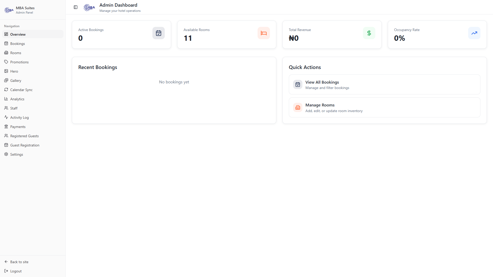

### Features

**Dashboard Statistics:**
- **Active Bookings** - Number of confirmed and pending bookings
- **Available Rooms** - Count of rooms currently available for booking
- **Total Revenue** - Cumulative revenue from all bookings
- **Occupancy Rate** - Percentage of rooms occupied

**Recent Bookings:**
- View the 5 most recent bookings
- See guest names, room information, check-in/check-out dates
- Monitor booking status (Pending, Confirmed, Completed, Cancelled)
- View booking amounts in your selected currency

**Quick Actions:**
- **View All Bookings** - Jump directly to the full bookings management interface
- **Manage Rooms** - Quick access to add, edit, or manage rooms

---

## Bookings Management

Manage all guest bookings, confirm reservations, and handle booking updates.

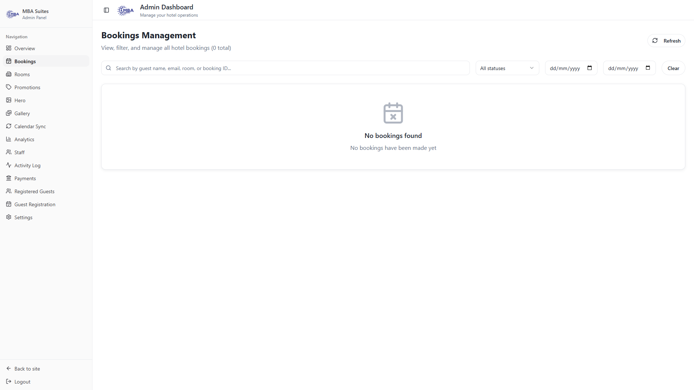

### Actions Available

**View Bookings:**
- Filter bookings by status (Pending, Confirmed, Completed, Cancelled)
- Search bookings by guest name or booking ID
- Paginate through bookings with load more functionality
- See detailed booking information including:
  - Guest name and email
  - Room information
  - Check-in and check-out dates
  - Number of guests
  - Total booking amount
  - Currency

**Confirm Bookings:**
- Change booking status from "Pending" to "Confirmed"
- Automatically sends confirmation email to guest
- Updates booking status in real-time
- Activity logged for audit trail

**Cancel Bookings:**
- Change booking status to "Cancelled"
- Prevents double-booking by freeing up room availability
- Automatically sends cancellation email to guest
- Activity logged with timestamp

**Complete Bookings:**
- Mark completed bookings after checkout
- Tracks booking lifecycle
- Helps with occupancy reports and analytics

**Edit Booking Status:**
- Quick status updates via dropdown selector
- Real-time updates reflected across the system
- All changes logged in Activity Log

### Tips
- Always confirm pending bookings promptly to maintain guest communication
- Review cancelled bookings to understand cancellation patterns
- Use status filters to focus on specific booking types

---

## Rooms Management

Create, edit, and manage your hotel room inventory.

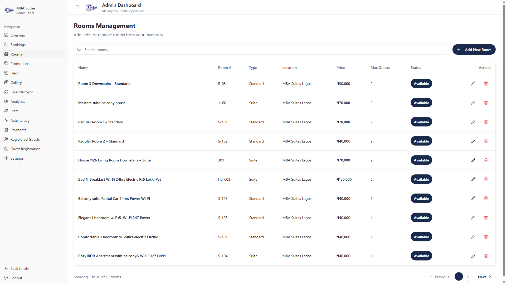

### Adding a New Room

**Required Information:**
- **Room Name** - e.g., "Deluxe Suite", "Standard Room"
- **Room Number** - Unique identifier for the room
- **Room Type** - Select from Standard, Deluxe, or Suite
- **Price Per Night** - In your base currency
- **Max Guests** - Maximum occupancy
- **Description** - Detailed room description (minimum 10 characters)
- **Amenities** - Select from available amenities like:
  - WiFi, Air Conditioning, Mini Bar, Room Service, TV
  - Safe, Balcony, City View, Ocean View, Jacuzzi
  - Kitchen, Work Desk

**Optional Information:**
- **Primary Image URL** - Featured image for the room
- **Additional Images** - Upload multiple room photos
- **Location** - Assign room to a specific location
- **Availability Status** - Toggle to make room available/unavailable

**Steps:**
1. Click on "Rooms" in the sidebar
2. Click "Add New Room" button
3. Fill in required fields
4. Upload or add image URLs
5. Click "Save Room"
6. Room is immediately available for bookings

### Editing Existing Room

1. Go to Rooms management section
2. Find the room in the list
3. Click the edit (pencil) icon
4. Modify any fields
5. Click "Save Changes"
6. Changes are reflected immediately in the system

### Deleting a Room

1. Go to Rooms management
2. Find the room to delete
3. Click the delete (trash) icon
4. Confirm deletion (cannot delete if active bookings exist)
5. Activity logged in audit trail

### Managing Room Availability

1. Toggle the "Available" switch next to each room
2. Unavailable rooms won't appear in guest booking searches
3. Useful for maintenance, cleaning, or temporarily closing rooms
4. Can be toggled on/off instantly

### Room Images

**Primary Image:**
- Used as featured image in listings
- Must be a valid image URL
- Displayed prominently in room details

**Additional Images:**
- Upload multiple photos per room
- Supports JPEG, PNG formats
- Stored in cloud storage
- Used for virtual tours and gallery

### Tips
- Keep room numbers unique and logical
- Provide detailed descriptions highlighting unique features
- Select accurate amenities for accurate searches
- Use high-quality images for better bookings
- Remove amenities that aren't available to avoid guest disappointment
- Always confirm no active bookings before deleting rooms

---

## Gallery & Room Media

Manage and organize all room photographs and media.

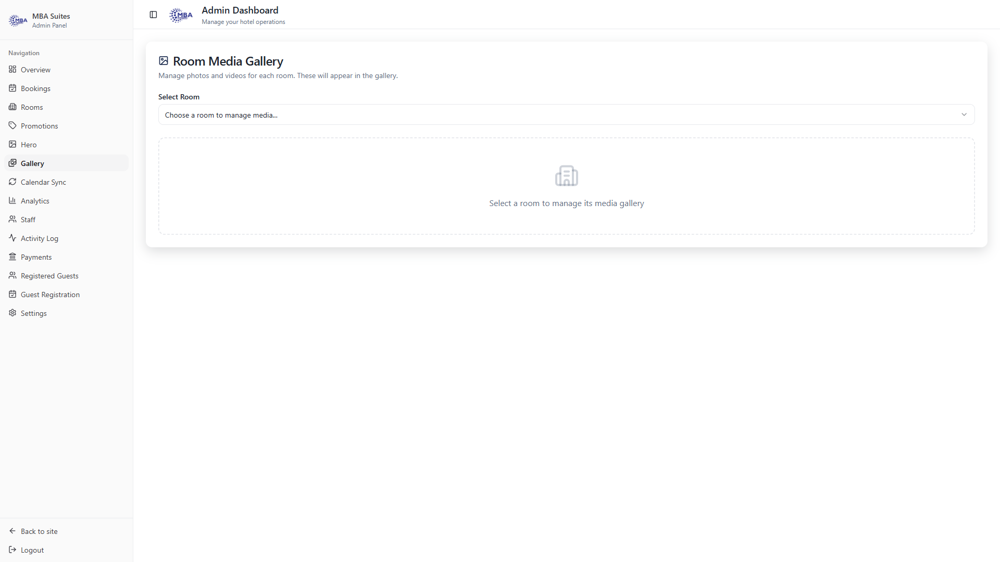

### Features

**Upload Room Images:**
- Upload multiple images per room
- Drag-and-drop interface for easy uploads
- Automatic image optimization
- Supports batch uploads

**Organize Gallery:**
- Set primary images for each room
- Reorder images by dragging
- Delete individual images if needed
- View image preview before publishing

**Image Management:**
- See which room each image belongs to
- Track upload dates
- Remove old or unwanted images
- Bulk management for multiple images

### Tips
- Upload high-quality images (minimum 800px width recommended)
- Include different angles, lighting, and perspectives
- Highlight unique features and amenities in photos
- Remove sensitive information from images
- Keep gallery organized by room type

---

## Hero Banner Management

Manage the main hero section on your website homepage.

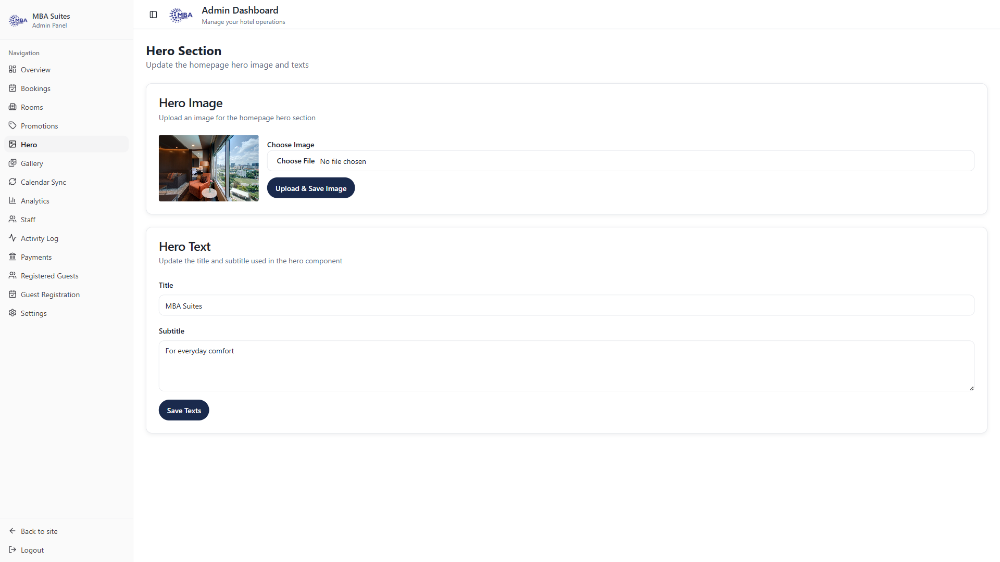

### Customizable Elements

**Hero Title:**
- Main headline displayed on homepage
- Should be compelling and brand-aligned
- Example: "Experience Luxury Hospitality"

**Hero Subtitle:**
- Secondary headline for context
- Example: "Premium rooms with world-class service"

**Background Image:**
- Large featured image for hero section
- Recommended size: 1920x1080 pixels
- Should showcase your best property features

**Call-to-Action:**
- Button text and link
- Drives traffic to bookings
- Customizable destination

### Actions

1. Click "Hero" in sidebar
2. Edit title and subtitle text
3. Update background image URL
4. Configure CTA button
5. Save changes
6. Changes appear immediately on homepage

### Tips
- Keep headlines concise and impactful
- Update seasonally or for special promotions
- Use professional, high-resolution images
- Test on mobile devices to ensure readability
- Include special promotional messaging during peak seasons

---

## Promotions Management

Create and manage promotional offers and special deals.

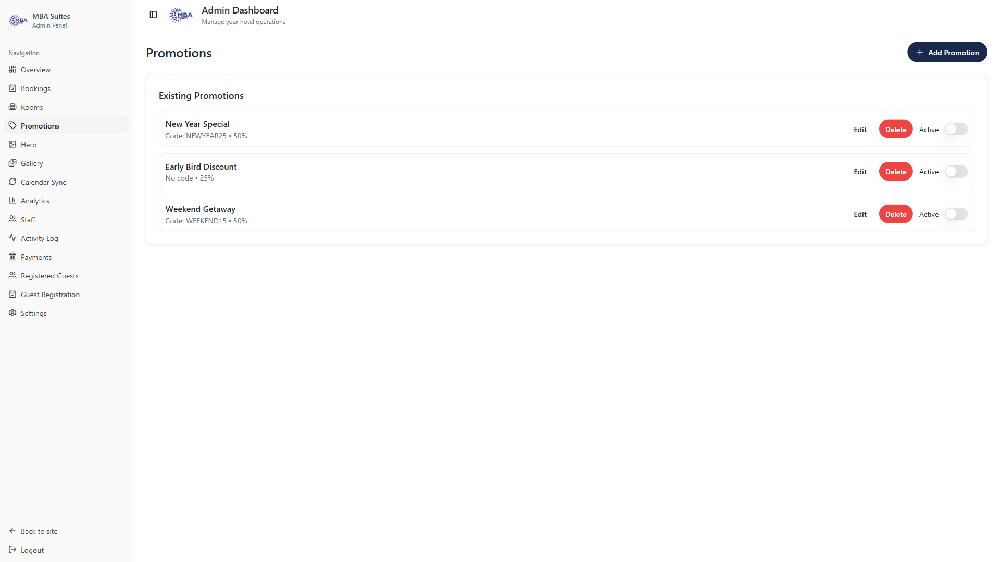

### Features

**Create Promotions:**
- Promotion code/name
- Discount type (Percentage or Fixed Amount)
- Discount value
- Valid date range
- Applicable rooms or all rooms
- Maximum uses (if limited)

**Promotion Details:**
- Description of the offer
- Terms and conditions
- Eligible guest types
- Blackout dates

**Track Promotion Performance:**
- View how many times promo used
- Track revenue impact
- See which rooms are most promoted
- Analyze guest segments using promotions

### Actions

**Add New Promotion:**
1. Click "Promotions" in sidebar
2. Click "Add New Promotion"
3. Fill in offer details
4. Set discount terms
5. Define availability
6. Click "Save Promotion"

**Edit Promotion:**
1. Find promotion in list
2. Click edit button
3. Modify details
4. Click "Save Changes"

**Deactivate Promotion:**
1. Toggle active/inactive status
2. Deactivated promotions won't appear to guests
3. Can be reactivated anytime

**Delete Promotion:**
1. Click delete button
2. Confirm deletion
3. Cannot recover deleted promotions

### Tips
- Use clear, memorable promotion codes
- Set realistic discount levels
- Monitor promotion effectiveness
- Regularly update for seasonal offers
- Blackout peak dates to protect revenue
- Create promotions for target segments (e.g., corporate, groups)

---

## Calendar Sync

Synchronize your booking calendar with external calendars.

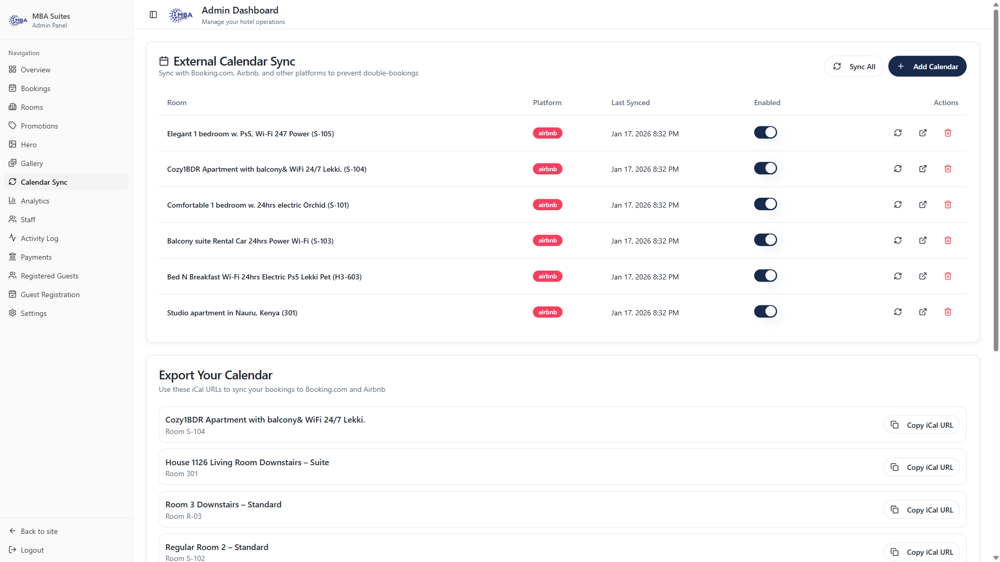

### Supported Integrations

- **Google Calendar** - Sync with personal Google Calendar
- **Outlook Calendar** - Sync with Microsoft Outlook
- **ICS Feeds** - Standard calendar format support
- **Other Calendar Services** - Via ICS feed integration

### Features

**Sync Bookings:**
- Automatically push bookings to external calendar
- See bookings in your preferred calendar app
- Real-time availability updates
- Prevent double-booking

**Sync Settings:**
- Configure which calendars to sync
- Set sync frequency
- Choose sync direction (one-way or two-way)
- Test sync connection

### How to Setup Sync

1. Click "Calendar Sync" in sidebar
2. Select calendar service to integrate
3. Follow authentication steps
4. Grant permissions to MBA Suites
5. Configure sync preferences
6. Test connection
7. Activate sync

### Managed Room Calendars

- Each room has its own calendar
- Shows availability status
- Updates in real-time
- Visible only to staff

### Tips
- Keep external calendar synced to prevent overselling
- Test sync before full deployment
- Monitor for sync errors or conflicts
- Use calendar for team coordination
- Set up notifications for bookings
- Regularly backup calendar data

---

## Analytics & Reports

Analyze business performance and generate insightful reports.

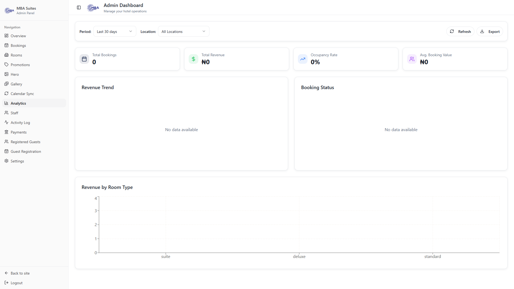

### Available Reports

**Booking Analytics:**
- Total bookings over time
- Bookings by status
- Average booking value
- Booking sources
- Guest repeat rate

**Revenue Analytics:**
- Revenue by period (daily, weekly, monthly)
- Revenue by room type
- Revenue by location
- Average revenue per room
- Revenue trends

**Occupancy Analytics:**
- Overall occupancy rate
- Occupancy by room type
- Peak occupancy periods
- Occupancy by location
- Seasonal trends

**Guest Analytics:**
- Guest count statistics
- Average group size
- Guest geographic distribution
- Guest type distribution
- Repeat guest percentage

**Operational Analytics:**
- Staff performance
- Payment method usage
- Cancellation rates
- Average length of stay
- Booking to arrival ratio

### Features

**View Reports:**
1. Click "Analytics" in sidebar
2. Select report type
3. Choose date range
4. Apply filters (location, room type, etc.)
5. View interactive charts and tables

**Export Data:**
- Export reports as CSV
- Export charts as images
- Generate PDF reports
- Schedule automated reports

**Customize Reports:**
- Select specific metrics
- Compare periods
- Filter by multiple criteria
- Create custom date ranges

### Tips
- Review analytics weekly for trends
- Use data to inform pricing strategy
- Identify peak seasons for promotions
- Monitor occupancy rates
- Track revenue per available room (RevPAR)
- Analyze cancellation patterns
- Use insights for inventory planning

---

## Staff Management

Manage admin and staff team members.

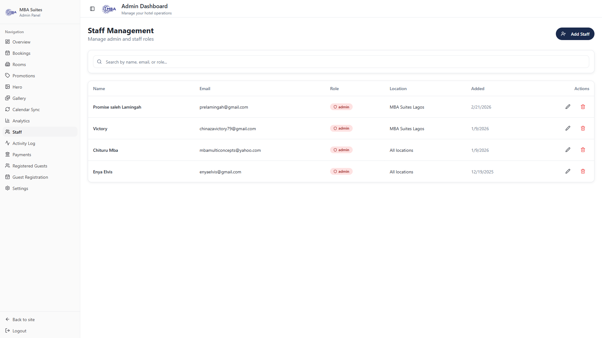

### Features

**Add Staff Member:**
- Email address
- Full name
- Role (Admin, Staff)
- Assigned locations
- Permissions/Access level
- Status (Active/Inactive)

**Staff Roles:**
- **Admin** - Full access to all features
- **Staff** - Limited access to assigned locations
- **Manager** - Management of rooms and bookings

**Permissions:**
- View bookings
- Manage bookings
- View rooms
- Manage rooms
- View analytics
- Manage staff
- View payments
- View activity logs

**Staff Dashboard Access:**
- Each staff member has limited view
- Only sees assigned locations
- Restricted to relevant data
- Activity tracked per staff member

### Actions

**Add New Staff:**
1. Click "Staff" in sidebar
2. Click "Add Staff Member"
3. Enter email address
4. Set name and role
5. Assign locations
6. Select permissions
7. Click "Save"
8. Staff member receives invitation email

**Edit Staff Details:**
1. Find staff member in list
2. Click edit button
3. Update information
4. Change permissions/assignments
5. Click "Save Changes"

**Deactivate Staff:**
1. Toggle active/inactive status
2. Deactivated staff can't access system
3. Can be reactivated

**Remove Staff:**
1. Click delete/remove button
2. Confirm removal
3. Staff access immediately revoked
4. Activity remains in logs

**Reset Staff Password:**
1. Click staff member
2. Click "Reset Password"
3. Staff receives reset link via email

### Tips
- Regularly review staff permissions
- Use location assignments for multi-property management
- Deactivate unused accounts for security
- Monitor staff activity through activity logs
- Grant minimal permissions needed for role
- Keep staff contact info updated

---

## Activity Log

View comprehensive audit trail of all system activities.

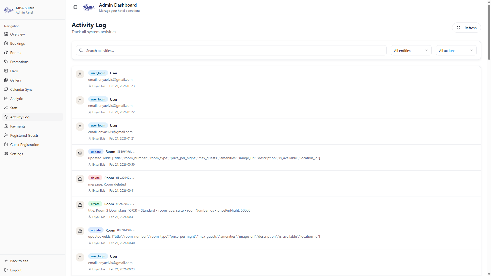

### Tracked Activities

**User Actions:**
- User logins and signups
- Profile updates
- Password changes
- Account settings modifications

**Booking Actions:**
- Booking creation
- Booking confirmations
- Booking cancellations
- Booking completions
- Status changes

**Room Actions:**
- Room creation
- Room edits
- Room deletions
- Availability changes
- Image uploads

**Review Actions:**
- Customer reviews
- Review ratings
- Review comments
- Review submissions

**Admin Actions:**
- Staff management
- Permission changes
- Settings modifications
- Promotional changes

**Payment Actions:**
- Payment processing
- Payment failures
- Refunds
- Payment confirmations

### Features

**View Activity Logs:**
1. Click "Activity" in sidebar
2. Browse log entries newest first
3. Click "Load More" for older entries
4. See timestamp for each activity

**Filter Activities:**
- **By Entity Type:** Users, Bookings, Rooms, Payments, Reviews, Profiles
- **By Action Type:** Create, Update, Delete, Confirm, Cancel, Login, Signup
- **By User:** Search by email or name
- **By Date Range:** Custom date selection

**Search Activities:**
- Search by user name or email
- Search by action type
- Search by entity details
- Full-text search in activity details

### Activity Details

Each log entry shows:
- **Action** - What was done (Create, Update, Delete, etc.)
- **Entity Type** - What was affected (Room, Booking, User, etc.)
- **User** - Who performed the action
- **Timestamp** - When the action occurred
- **Details** - Specific changes made
- **IP Address** - Where action originated

### Tips
- Review activity logs weekly
- Monitor suspicious activities
- Track staff actions for accountability
- Investigate unusual patterns
- Use logs for troubleshooting
- Archive logs for compliance
- Review changes made by staff
- Monitor user registrations and logins

---

## Payment Management

Manage guest payments and financial transactions.

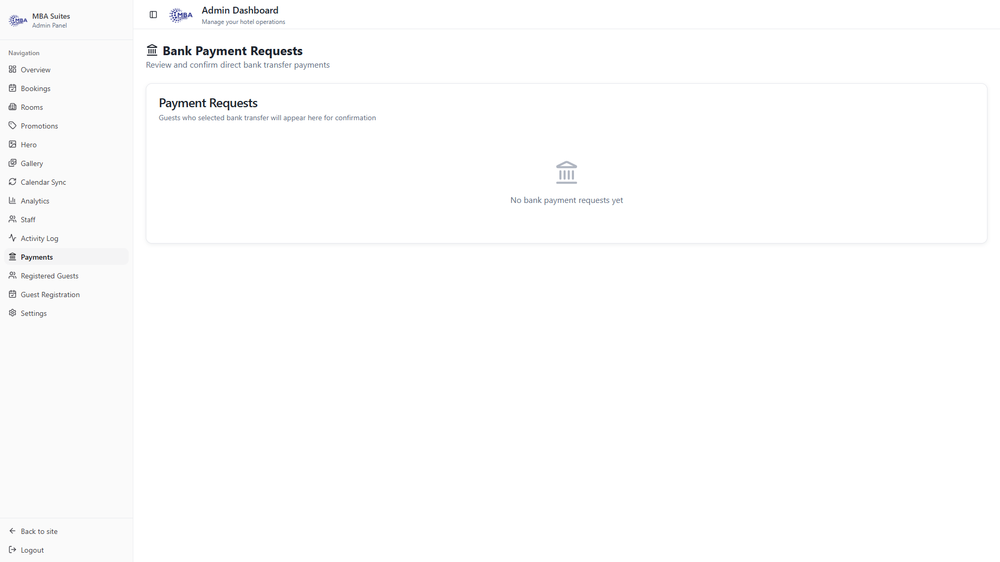

### Bank Payment Requests

**View Payment Requests:**
1. Click "Payments" in sidebar
2. See all pending payment requests
3. Filter by status (Pending, Completed, Failed)
4. Sort by date, amount, or guest

**Payment Request Details:**
- Guest name and email
- Booking associated with payment
- Payment amount
- Payment reference number
- Payment deadline
- Current status
- Payment proof if uploaded

**Process Payment:**
1. Review payment request details
2. Request payment from guest (auto-email sent)
3. Guest uploads payment proof
4. Review proof documents
5. Mark as "Received" or "Incomplete"
6. Update booking status

**Manage Payment Requests:**
- Extend payment deadline
- Send payment reminders
- Cancel payment request
- Mark as refunded
- Add admin notes
- Attach proof documents

### Payment Tracking

**Monitor Payments:**
- Track pending payments
- See overdue payments
- Monitor payment compliance
- Generate payment reports

**Payment Methods Accepted:**
- Bank transfers
- Credit/Debit cards
- Digital wallets
- Installment plans

**Payment Confirmation:**
- Guest receives confirmation email
- Payment logged in system
- Booking marked as paid
- Revenue recorded

### Tips
- Send payment reminders regularly
- Keep payment deadlines clear
- Verify all proof documents
- Document all payment details
- Follow up on failed payments
- Maintain payment security standards
- Archive payment records

---

## Guest Management

Manage guest registrations and information.

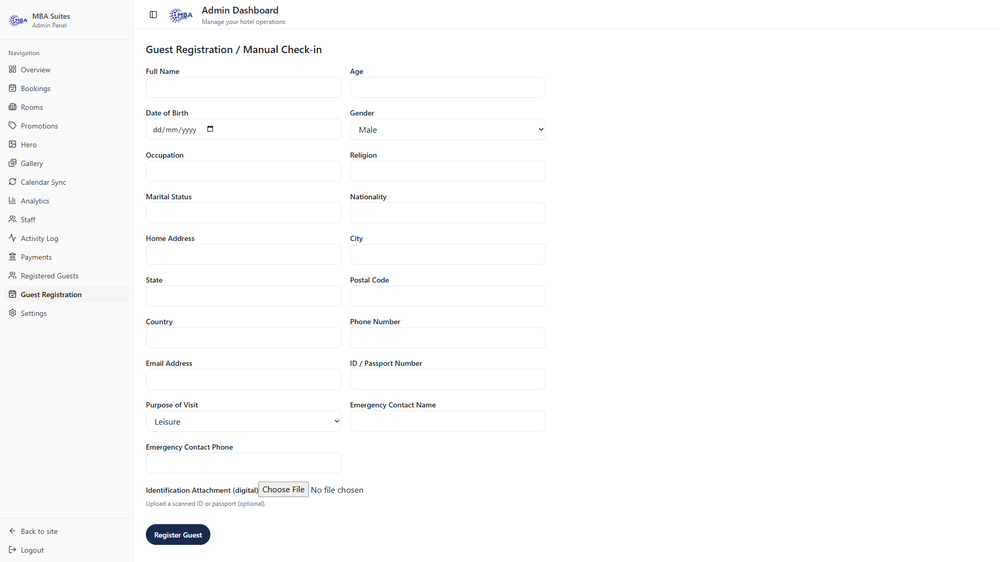
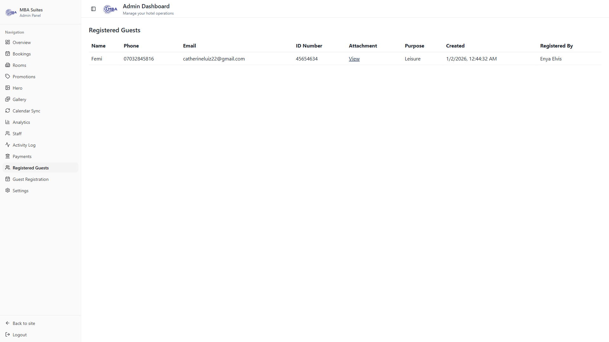

### Guest Registration

**View Guest Registrations:**
1. Click "Guest Registration" in sidebar
2. See all guest registrations
3. View registration details
4. Track registration status

**Guest Information Captured:**
- Full name
- Email address
- Phone number
- Address and location
- Preferred room type
- Special requests/notes
- Registration date
- Booking history

**Manage Guest Details:**
- View guest profile
- Update contact information
- Add notes/preferences
- Flag VIP guests
- Track guest history
- View all bookings

### Guest List

**View All Guests:**
1. Click "Guest List" in sidebar
2. Browse all registered guests
3. Search by name or email
4. Filter by registration date
5. See guest statistics

**Guest Actions:**
- View guest profile
- See booking history
- Send messages to guests
- Add preferences
- Block problem guests
- Export guest list

**Guest Preferences:**
- Room preference (location, type)
- Special dietary needs
- Accessibility requirements
- Communication preference
- Loyalty status
- VIP status

### Tips
- Keep guest information updated
- Use notes for special preferences
- Identify and reward loyal guests
- Segment guests for marketing
- Maintain guest privacy
- Use preferences for personalization
- Track guest satisfaction
- Monitor repeat bookings

---

## Payment Settings

Configure payment methods and financial settings.

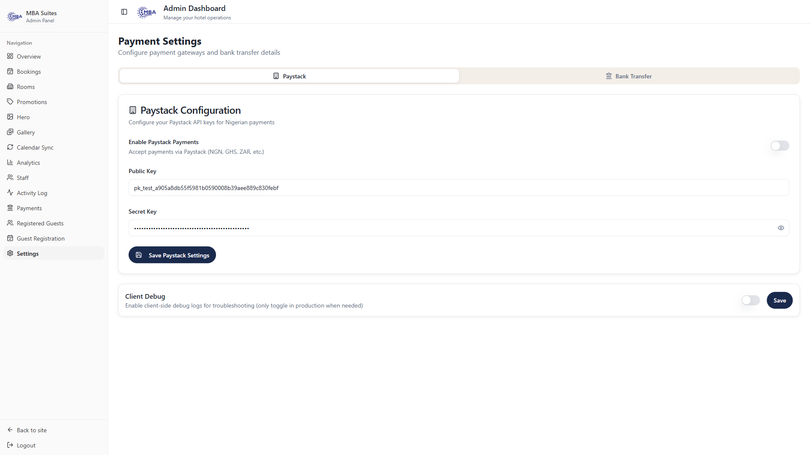

### Settings Available

**Payment Methods:**
- Enable/disable payment methods
- Configure payment gateway credentials
- Set payment processing fees
- Define payment deadlines

**Currency Settings:**
- Set primary currency
- Enable multi-currency support
- Configure currency conversion rates
- Set currency for reporting

**Payment Terms:**
- Define payment policies
- Set deposit requirements
- Configure refund policies
- Define payment deadlines

**Banking Information:**
- Bank account details
- Payment recipient information
- Account verification status
- Fund transfer settings

**Payment Gateway:**
- Select payment processor
- Configure API credentials
- Test payment processing
- Enable/disable specific payment methods on gateway

### Configuration Steps

1. Click "Settings" in sidebar
2. Select "Payment Settings"
3. Configure payment methods
4. Set currency preferences
5. Define payment policies
6. Enter banking information
7. Test payment gateway
8. Save all settings

### Security

- PCI-DSS compliant
- Encrypted payment data
- Secure transactions
- Fraud detection enabled
- Payment verification required

### Tips
- Use reputable payment gateways
- Enable multiple payment options
- Keep banking info secure
- Test payments regularly
- Monitor transaction fees
- Review fraud settings
- Maintain PCI compliance
- Archive payment records

---

# Quick Reference

## Most Common Tasks

### Daily Tasks
- ✅ Check Overview dashboard for new bookings
- ✅ Confirm pending bookings
- ✅ Review recent activity log
- ✅ Check for payment requests

### Weekly Tasks
- ✅ Review analytics and reports
- ✅ Check occupancy rates
- ✅ Follow up on overdue payments
- ✅ Analyze booking patterns

### Monthly Tasks
- ✅ Generate comprehensive reports
- ✅ Review staff performance
- ✅ Update promotions
- ✅ Plan inventory adjustments
- ✅ Review guest feedback
- ✅ Analyze revenue trends

## Keyboard Shortcuts

- Press `R` - Refresh current section
- Press `/` - Search (when available)
- Press `ESC` - Close dialogs

## Support & Help

For questions or issues:
1. Check this guide first
2. Review activity logs for context
3. Contact system administrator
4. Check for system notifications

## Additional Resources

- **Email Support** - admin@mbasuites.com
- **Documentation** - Available in-system
- **FAQs** - Help section on dashboard
- **Video Tutorials** - Coming soon

---

**Last Updated:** February 21, 2026  
**Version:** 1.0  
**Dashboard Version:** Latest

---

## Summary

The MBA Suites Admin Dashboard provides comprehensive tools to manage all aspects of your hotel operations. Key capabilities include:

- **Complete Booking Management** - Create, confirm, and track reservations
- **Inventory Control** - Manage rooms, availability, and properties
- **Financial Oversight** - Track payments, revenue, and financial metrics
- **Guest Relations** - Maintain guest information and preferences
- **Staff Coordination** - Manage team members and permissions
- **Data Analysis** - Generate reports and insights
- **Audit Trail** - Track all activities
- **Integration Support** - Connect to external services

By mastering each section of this guide, you'll be able to efficiently manage every aspect of your hotel business!
